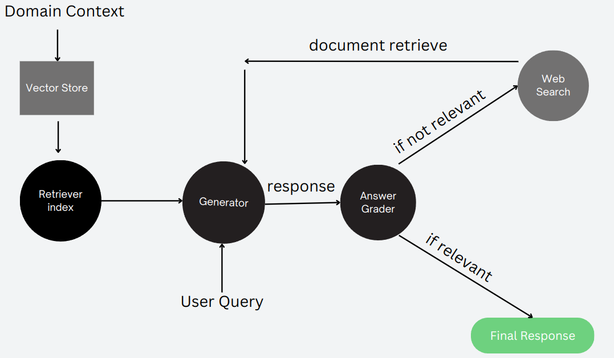

<div style="display: flex; align-items: center;">
  
  <span style="font-size: 24px;">Questor</span>
</div>

### Contents:
- [Introduction](https://github.com/supremex04/contextual-search?tab=readme-ov-file#introduction)
- [Why Questor?](https://github.com/supremex04/contextual-search?tab=readme-ov-file#why-questor)
- [Tech Stack](https://github.com/supremex04/contextual-search?tab=readme-ov-file#tech-stack)
- [How to run locally?](https://github.com/supremex04/contextual-search?tab=readme-ov-file#how-to-run-locally)

### Introduction
Questor is a domain-specific search engine designed to provide precise and relevant information based on predefined contexts. Currently, it has been implemented for two domains: Health (specifically cardio-vascular) and Legal. It takes context specific natural language as input and provides relevant output using contextual and semantic searching.

### Why Questor?
- **Traditional Google Search**:
  - Highly efficient in fetching relevant web pages based on user keywords.
  - Lacks understanding of the actual context/meaning of the search query.

- **Limitations of LLMs**:
  - Performance degrades as the domain field is narrowed down.
  - Struggles with more domain-specific prompts.

- **Questor Solution**:
  - Extracts additional context from domain-specific PDF files.
  - Feeds this context to the LLM.
  - Utilizes the generative abilities of LLM to produce human-like text.
  - Capable of performing web searches if the user prompt does not match the information available in the provided PDF files.


### Tech Stack



## How to run locally?

On the project folder:

> ``` npm install ```

> ```pip install -r requirements.txt```


Run server:
> ```python3 medilens_server.py```
> ```python3 legallens_server.py```

### Backend Server will run at: [http://localhost:5000](http://localhost:5000)

Change the directory to projectFolder/web:
> ```cd web```

Install npm packages:
> ```npm install```

Run the frontend:
> ```npm start```


### Frontend will run at: [http://localhost:3000/](http://localhost:3000/)
